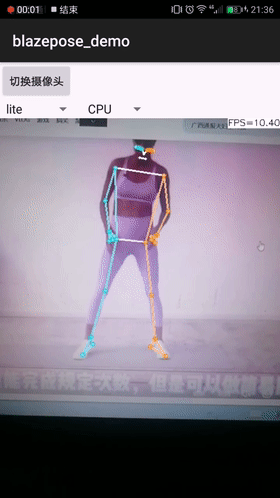

演示视频:  
---

<table>
  <tr>
    <td align="center">
      <video src="https://github.com/user-attachments/assets/4fed74b4-f9d2-45dd-b763-21a49b68927a"
             controls width="300"></video> 
      <b>俯卧撑</b>
    </td>
    <td align="center">
      <video src="https://github.com/user-attachments/assets/6cafb483-d371-44c1-8695-c8c60bc54283"
             controls width="300"></video> 
      <b>仰卧起坐</b>
    </td>
    <td align="center">
      <video src="https://github.com/user-attachments/assets/c0252956-3bac-4455-9fe3-b18d3786e961"
             controls width="300"></video> 
      <b>引体向上</b>
    </td>
    <td align="center">
      <video src="https://github.com/user-attachments/assets/c91ad9a1-05f1-41ab-8806-517dd7c621a5"
             controls width="300"></video> 
      <b>深蹲</b>
    </td>
  </tr>
</table>

# ncnn_Android_BlazePose
Android BlazePose demo by ncnn  

this project is a ncnn Android demo for BlazePose, it depends on ncnn library and opencv.  
https://github.com/Tencent/ncnn  
https://github.com/nihui/opencv-mobile
## model support:  
1.lite  
2.full  
3.heavy  
## how to build and run
### step1
https://github.com/Tencent/ncnn/releases

* Download ncnn-YYYYMMDD-android-vulkan.zip or build ncnn for android yourself
* Extract ncnn-YYYYMMDD-android-vulkan.zip into **app/src/main/jni** and change the **ncnn_DIR** path to yours in **app/src/main/jni/CMakeLists.txt**

### step2
https://github.com/nihui/opencv-mobile

* Download opencv-mobile-XYZ-android.zip
* Extract opencv-mobile-XYZ-android.zip into **app/src/main/jni** and change the **OpenCV_DIR** path to yours in **app/src/main/jni/CMakeLists.txt**

### step3
* Open this project with Android Studio, build it and enjoy!
## result  
 
  
## reference:  
https://github.com/nihui/ncnn-android-nanodet  
https://google.github.io/mediapipe/solutions/pose  

/***********************
git init
git add readme.md
git commit -m "first commit"
git branch -M main
git remote git@github.com:wuzengqun/BlazePose_ncnn_PhysicalTestCount.git
git push -u origin main
***********************/